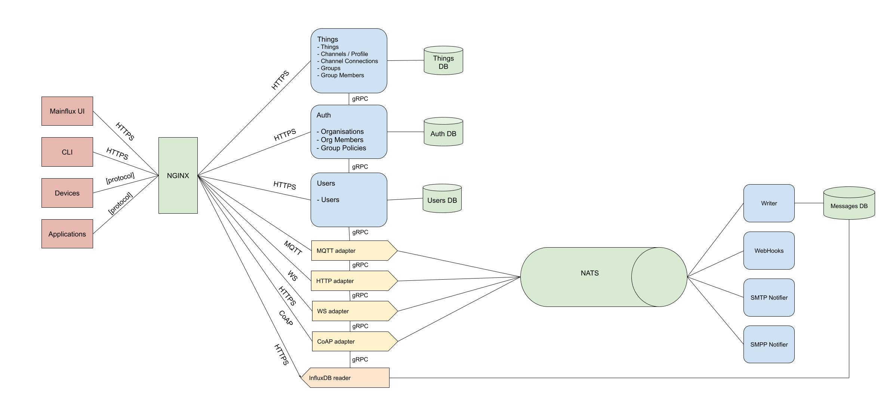

# Architecture

## Components

Mainflux IoT platform is comprised of the following services:

| Service                                                                       | Description                                                      |
|:------------------------------------------------------------------------------|:-----------------------------------------------------------------|
| [auth](https://github.com/MainfluxLabs/mainflux/tree/master/auth)             | Manages platform's orgs and auth concerns                        |
| [users](https://github.com/MainfluxLabs/mainflux/tree/master/users)           | Manages platform's users and auth concerns                       |
| [things](https://github.com/MainfluxLabs/mainflux/tree/master/things)         | Manages platform's things, profiles, groups and group members    |
| [http-adapter](https://github.com/MainfluxLabs/mainflux/tree/master/http)     | Provides an HTTP interface for sending messages                  |
| [mqtt-adapter](https://github.com/MainfluxLabs/mainflux/tree/master/mqtt)     | Provides an MQTT and MQTT over WS interface for sending messages |
| [coap-adapter](https://github.com/MainfluxLabs/mainflux/tree/master/coap)     | Provides a CoAP interface for sending messages                   |
| [mainfluxlabs-cli](https://github.com/MainfluxLabs/mainflux/tree/master/cli)  | Command line interface                                           |

## Domain Model

The platform is built around 5 main entities: **users**, **organizations**, **groups**, **profiles** and **things**.

`User` represents the real (human) user of the system. It is represented via its
e-mail and password, which he uses as platform access credentials in order to obtain
an access token. Once logged into the system, user can manage his resources (i.e. groups,
things and profiles) in CRUD fashion and define access control.

`Org` represents the highest entity in the system hierarchy consisting of its `members` and `groups`. It unites all the elements into a whole.

`Group` within an organization represents a set of Things, Profiles, Notifiers, Webhooks, Downlinks. Access to these entities requires appropriate rights, which are obtained when assigning a user to a group.

`Profile` determines message topics that can be consumed by all things to which it is assigned.

`Thing` represents devices (or applications) connected to Mainflux that uses the
platform for message exchange with other "things".

## Messaging

Mainflux uses [NATS](https://nats.io) as its messaging backbone, due to its
lightweight and performant nature. You can treat its *subjects* as physical
representation of Mainflux channels, where subject name is constructed using
channel unique identifier.

In general, there is no constrained put on content that is being exchanged
through channels. However, in order to be post-processed and normalized,
messages should be formatted using [SenML](https://tools.ietf.org/html/draft-ietf-core-senml-08).

## Unified IoT Platform
Running Mainflux on gateway moves computation from cloud towards the edge thus decentralizing IoT system.
Since we can deploy same Mainflux code on gateway and in the cloud there are many benefits but the biggest one is easy deployment and adoption - once the engineers understand how to deploy and maintain the platform, they will have the same known work across the whole edge-fog-cloud continuum.
Same set of tools can be used, same patches and bug fixes can be applied. The whole system is much easier to reason about, and the maintenance is much easier and less costly.
