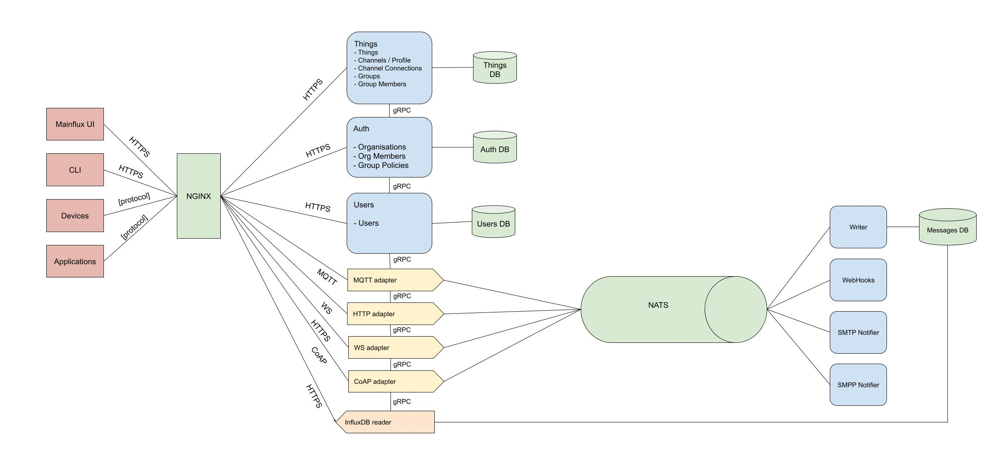

# Architecture

## Components

Mainflux IoT platform is comprised of the following services:

| Service                                                                                              | Description                                                                  |
|:-----------------------------------------------------------------------------------------------------|:-----------------------------------------------------------------------------|
| [auth](https://github.com/MainfluxLabs/mainflux/tree/master/auth)                                    | Manages platform's orgs and auth concerns                                    |
| [users](https://github.com/MainfluxLabs/mainflux/tree/master/users)                                  | Manages platform's users and auth concerns                                   |
| [things](https://github.com/MainfluxLabs/mainflux/tree/master/things)                                | Manages platform's things, profiles, groups and group members                |
| [certs](https://github.com/MainfluxLabs/mainflux/tree/master/certs)                                  | Issues and manages X.509 certificates for mTLS device authentication         |
| [http-adapter](https://github.com/MainfluxLabs/mainflux/tree/master/http)                            | Provides an HTTP interface for sending messages                              |
| [mqtt-adapter](https://github.com/MainfluxLabs/mainflux/tree/master/mqtt)                            | Provides an MQTT and MQTT over WS interface for sending messages             |
| [coap-adapter](https://github.com/MainfluxLabs/mainflux/tree/master/coap)                            | Provides a CoAP interface for sending messages                               |
| [ws-adapter](https://github.com/MainfluxLabs/mainflux/tree/master/ws)                                | Provides a WebSocket interface for sending and receiving messages            |
| [modbus](https://github.com/MainfluxLabs/mainflux/tree/master/modbus)                                | Polls Modbus TCP devices on a schedule and publishes readings as messages    |
| [rules](https://github.com/MainfluxLabs/mainflux/tree/master/rules)                                  | Evaluates threshold rules and Lua scripts against incoming device messages   |
| [alarms](https://github.com/MainfluxLabs/mainflux/tree/master/consumers/alarms)                      | Persists alarms triggered by the rules engine or Lua scripts to PostgreSQL   |
| [downlinks](https://github.com/MainfluxLabs/mainflux/tree/master/downlinks)                          | Manages scheduled outbound HTTP requests (downlinks) for things and groups   |
| [webhooks](https://github.com/MainfluxLabs/mainflux/tree/master/webhooks)                            | Forwards device messages to external HTTP endpoints                          |
| [smtp-notifier](https://github.com/MainfluxLabs/mainflux/tree/master/cmd/smtp-notifier)              | Sends email notifications to contacts defined on notifier records            |
| [smpp-notifier](https://github.com/MainfluxLabs/mainflux/tree/master/cmd/smpp-notifier)              | Sends SMS notifications to contacts defined on notifier records              |
| [converters](https://github.com/MainfluxLabs/mainflux/tree/master/converters)                        | Accepts CSV uploads and publishes parsed rows as messages for bulk ingestion |
| [filestore](https://github.com/MainfluxLabs/mainflux/tree/master/filestore)                          | Provides file storage for things and groups                                  |
| [uiconfigs](https://github.com/MainfluxLabs/mainflux/tree/master/uiconfigs)                          | Persists and manages UI configuration settings scoped per org and per thing  |
| [mongodb-writer](https://github.com/MainfluxLabs/mainflux/tree/master/consumers/writers/mongodb)     | Persists messages to MongoDB                                                 |
| [mongodb-reader](https://github.com/MainfluxLabs/mainflux/tree/master/readers/mongodb)               | Provides an HTTP API for querying messages from MongoDB                      |
| [postgres-writer](https://github.com/MainfluxLabs/mainflux/tree/master/consumers/writers/postgres)   | Persists messages to PostgreSQL                                              |
| [postgres-reader](https://github.com/MainfluxLabs/mainflux/tree/master/readers/postgres)             | Provides an HTTP API for querying messages from PostgreSQL                   |
| [timescale-writer](https://github.com/MainfluxLabs/mainflux/tree/master/consumers/writers/timescale) | Persists messages to TimescaleDB                                             |
| [timescale-reader](https://github.com/MainfluxLabs/mainflux/tree/master/readers/timescale)           | Provides an HTTP API for querying messages from TimescaleDB                  |
| [cli](https://github.com/MainfluxLabs/mainflux/tree/master/cli)                                      | Command line interface                                                       |

## Domain Model

The platform is built around 5 main entities: **users**, **organizations**, **groups**, **profiles** and **things**.

`User` represents the real (human) user of the system. It is represented via its
e-mail and password, which he uses as platform access credentials in order to obtain
an access token. Once logged into the system, user can manage his resources (i.e. groups,
things and profiles) in CRUD fashion and define access control.

`Org` represents the highest entity in the system hierarchy consisting of its `members` and `groups`. It unites all the elements into a whole.

`Group` within an organization represents a set of Things, Profiles, Notifiers, Webhooks, Downlinks. Access to these entities requires appropriate rights, which are obtained when assigning a user to a group.

`Profile` defines the message format and processing rules for all things assigned to it. Things within the same profile share the same communication contract (content type, data transformation, filtering, and routing settings).

`Thing` represents devices (or applications) connected to Mainflux that uses the
platform for message exchange with other "things".

## Messaging

Mainflux uses [NATS](https://nats.io) as its messaging backbone, due to its
lightweight and performant nature. NATS subjects are derived from the message
content type and optional subtopic, following the format
`<format>.messages.<optional_subtopic>` (e.g. `senml.messages.bedroom.temperature`).

In general, there is no constraint on the content exchanged between things.
However, in order to be post-processed and normalized,
messages should be formatted using [SenML](https://tools.ietf.org/html/draft-ietf-core-senml-08).

## Unified IoT Platform
Running Mainflux on gateway moves computation from cloud towards the edge thus decentralizing IoT system.
Since we can deploy same Mainflux code on gateway and in the cloud there are many benefits but the biggest one is easy deployment and adoption - once the engineers understand how to deploy and maintain the platform, they will have the same known work across the whole edge-fog-cloud continuum.
Same set of tools can be used, same patches and bug fixes can be applied. The whole system is much easier to reason about, and the maintenance is much easier and less costly.
